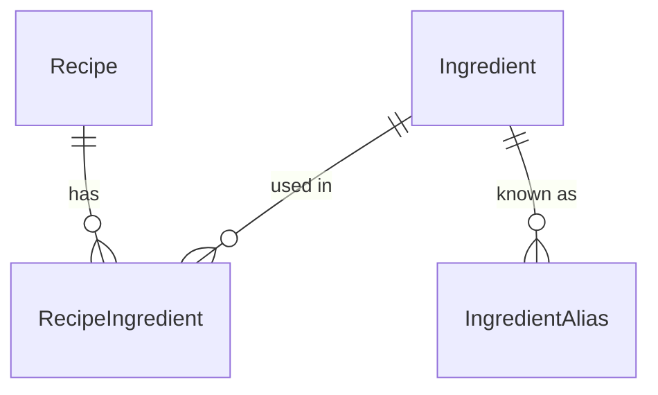

# recipe-app

Self-hosted, ad-free web application for managing recipes, generating weekly
suggestions and deriving a shopping list from them.

A private project for a single household to begin with: no multi-tenancy, no
public sign-up. Opening it up as a multi-user application is the long-term plan
and is already designed — see [Multi-user (V4)](#multi-user-v4).

## Why this exists

Four apps' worth of features, without the four apps:

- a recipe book and a weekly meal plan, like Chefkoch
- a shopping list built from that plan, like Bring!
- random suggestions for when nothing comes to mind, like HelloFresh — minus
  the subscription box
- calories and macros per serving, and what the planned week adds up to, like
  Lifesum — without logging every meal by hand

None of the four is new on its own. The point is that they stop being separate:
the plan is built from your own recipes, the shopping list is built from the
plan, and the nutrition figures come from the same recipes the plan is made of.
Because the plan already knows what is for dinner, the planned meals need no
logging. It is not a full food diary — a snack outside the plan is not counted —
but it answers the question most weeks actually pose.

Free, ad-free, no account required, running on hardware you own.

## Status

Under development. See [Roadmap](#roadmap) for what is and is not implemented.

## Tech stack

| Layer          | Choice                                         |
| -------------- | ---------------------------------------------- |
| Backend        | NestJS, TypeScript                             |
| ORM            | Prisma                                         |
| Second backend | ASP.NET Core, C#, EF Core — planned, see below |
| Database       | PostgreSQL 18                                  |
| Frontend       | Angular, standalone components                 |
| Runtime        | Docker Compose                                 |

## Requirements

- Node.js 24 (see `.nvmrc`)
- Docker with Compose v2
- Optionally a PostgreSQL client (`postgresql-client`, DBeaver, pgAdmin) to
  connect to the database from the host

## Getting started

```bash
# For Web connection
git clone https://github.com/LittlePumpkin87/recipe-app
# For SSH connection
git clone git@github.com:LittlePumpkin87/recipe-app.git

cd recipe-app

# 1. Create your environment file
cp .env.example .env

# 2. Generate a database password and put it into BOTH POSTGRES_PASSWORD
#    and the password part of DATABASE_URL in .env
openssl rand -hex 32

# 3. Start the database
docker compose up -d db

# 4. Install dependencies
npm install

# 5. Create the database tables
cd apps/api && npx prisma migrate dev && cd ../..

# 6. Optional: fill the database with development data
cd apps/api && npx prisma db seed && cd ../..

# 7. Start the API in watch mode
npm run start:dev -w api
```

The API listens on http://localhost:3000.

Step 5 is the one that is easy to miss: steps 1 to 4 leave you with a running
but completely empty database. See [Prisma and migrations](#prisma-and-migrations)
for what that command does and why it is the only one run from inside
`apps/api`.

Verify that the database is up:

```bash
docker compose ps          # db should report "healthy"
```

### A note on the password

`DATABASE_URL` is a URI, in which `:`, `@`, `/`, `?` and `#` carry structural
meaning. A password containing any of them breaks the connection string unless
it is percent-encoded — and then the same secret would have to be written in
two different spellings inside `.env`.

Generating the password with `openssl rand -hex 32` avoids this: hex output
contains only `0-9a-f`, so the identical literal can be used in both places.
Do not use `openssl rand -base64`, whose alphabet includes `+`, `/` and `=`.

## Repository layout

This is an npm workspaces monorepo. Application packages live under `apps/`.

```
.
├── apps/
│   └── api/                # NestJS backend (workspace name: "api")
│       ├── prisma/         # schema, migrations and seed.ts
│       ├── requests.http   # example requests for the VS Code REST Client
│       └── src/
│           ├── common/             # helpers shared by seed and services
│           ├── generated/prisma/   # Prisma client — generated, never edited
│           ├── prisma/             # PrismaService, global
│           ├── recipes/            # feature module
│           └── ingredients/        # feature module
├── docker-compose.yml      # local infrastructure
├── .env                    # local secrets — never committed
└── .env.example            # template for .env
```

## Backend

The API is an npm workspace named `api`. Run its scripts from the repository
root using the `-w` flag:

```bash
npm run start:dev -w api    # watch mode
npm run start:prod -w api   # run the compiled build from dist/
npm run build -w api        # production build
npm run test -w api         # unit tests
npm run test:e2e -w api     # end-to-end tests
npm run test:cov -w api     # unit tests with coverage report
npm run lint -w api         # oxlint over src/ and test/
npm run format -w api       # prettier over src/ and test/
npm install <pkg> -w api    # add a dependency to the API, not to the root
```

Always pass `-w api` when installing. Because npm workspaces hoist packages
into the root `node_modules`, an import can resolve successfully even though
the dependency is not declared in `apps/api/package.json` — which only breaks
once the API is deployed on its own.

Environment variables are read from the `.env` file in the repository root.
`npm run <script> -w api` sets the working directory to `apps/api`, not to the
repository root, so both places that load the file resolve it two levels up:
`ConfigModule` in `src/app.module.ts` for the running application, and
`prisma7.config.ts` for the Prisma CLI.

Inside `src/`, each area of the domain gets one folder holding three files: a
module, a controller and a service. The controller receives HTTP requests and
knows about paths, status codes and query parameters. The service holds the
logic and is the only place a database query may live. The module wires the two
together — it binds the controller to routes at startup and makes the service
injectable, but takes no part in handling a request.

The split pays off when the data source changes: turning a service method into
a Prisma query leaves its controller untouched. New folders are created with
`npx nest g module <name>` from inside `apps/api`, which also registers the
module in `src/app.module.ts`.

The API is compiled to CommonJS. `apps/api/tsconfig.json` sets
`"module": "nodenext"`, which defers to the `type` field of the nearest
`package.json`; since none is set, the emitted output is CommonJS and relative
imports are written without a file extension.

A JSDoc block is written only where deleting it would lose information: why a
file exists, a promise the types cannot express (a sort order, an `amount`
already converted from `Decimal`), or a deliberate absence — such as the missing
lookup before the insert in `IngredientsService.create`. A block that restates a
name or a field list is left out, so a self-explanatory interface gets none.
Where a block exists, it sits directly above the declaration, not above the
imports: TypeScript attaches the text to the symbol, so hovering
`PrismaService` anywhere in the editor shows it without opening the file.

### DTOs, mappers and validation

No Prisma row ever leaves a service. Each feature folder holds a `dto/` folder
and a mapper, and the three shapes involved are deliberately different:

| | Prisma model | Response DTO | Request DTO |
|---|---|---|---|
| Describes | how a row is stored | what the API returns | what a client may send |
| `ingredient.id` | ✓ | ✓ | —, Postgres assigns it |
| `ingredient.nameNormalized` | ✓ | — | —, the service derives it |

`RecipeDetailDto` shows why this is not busywork: it exposes a field called
`ingredients` that exists in no table. In the database the relation is called
`recipeIngredients` and the ingredient name sits one table deeper; the mapper
pulls it up and converts `amount` from a Prisma `Decimal` to a plain number,
which would otherwise serialise as a quoted string. The list DTO drops
`instructions` entirely so the overview stays small as the recipe count grows.

Each mapper derives its input type from the same `select` or `include` constant
the service queries with — `Prisma.RecipeGetPayload<{ select: typeof
recipeListSelect }>` — so a column removed from the query becomes a compiler
error in the mapper rather than an `undefined` in a response.

**Response DTOs are interfaces, request DTOs are classes.** That is not a style
choice. `main.ts` registers a global `ValidationPipe`:

```ts
app.useGlobalPipes(
  new ValidationPipe({
    whitelist: true,
    forbidNonWhitelisted: true,
    transform: true,
  }),
);
```

A pipe runs between the request and the controller method: it receives the raw
value, returns the value the parameter will hold, or throws. `ParseUUIDPipe` on
`GET /recipes/:id` is the same mechanism in its smallest form.

The `class-validator` decorators — `@IsString()`, `@MaxLength(120)` — do not
check anything by themselves. They register metadata, and the pipe is what calls
`validate()` and reads it. To know *which* class to validate against, the pipe
reads the declared type of the parameter, which the compiler emits thanks to
`emitDecoratorMetadata`. An interface is erased at compile time and leaves
nothing to read, so a request DTO written as an interface would be waved
through unchecked. Response DTOs are never validated and stay interfaces.

The three options each buy something specific. `whitelist` drops properties that
carry no validation decorator, so a client cannot smuggle in an `id`.
`forbidNonWhitelisted` turns that silent drop into a 400 naming the field, which
is the difference between debugging a typo and not noticing it. `transform`
turns the parsed JSON into a real instance of the DTO class, which is what
nested DTOs and type coercion need.

Validation rules belong in the DTO even where the database has its own
constraint. `NOT NULL` forbids `NULL`, not `""` — a minimum length is an API
question. `@MaxLength(120)` mirrors `@db.VarChar(120)` on purpose: the database
protects itself, the DTO tells the client what is allowed, and the difference
shows up as a 400 with a field name instead of a 500 with a database error.

## Data model

Four models and one enum. The join table carries the amount, the unit and three
presentation fields in addition to the relation, which is why it is written out
explicitly rather than left to Prisma's implicit many-to-many.



| Model | Purpose |
|---|---|
| `Recipe` | Title, description, instructions, servings, `prepMinutes` and `totalMinutes`, optional import provenance. |
| `Ingredient` | Central ingredient list. One row per ingredient, shared across recipes. |
| `IngredientAlias` | Alternative spellings pointing at an ingredient ("zwiebeln" → "Zwiebel"). |
| `RecipeIngredient` | Join table between the two, carrying `amount`, `unit`, a per-line `note`, a `groupLabel` and the `position` within the recipe. |

### Design decisions

**Units are an enum, not free text.** A string column produces "tbsp", "Tbsp"
and "tablespoon" as three distinct units, which makes the V2 shopping list
impossible to aggregate. No conversion happens anywhere — not even grams to
kilograms; amounts are only ever added up when the unit is identical. That is
also why `CUP` is harmless despite being defined differently around the world.

**Uniqueness sits on `nameNormalized`, not on `name`.** A `@unique` on `name`
compares byte for byte and would happily store "Zwiebel" next to "zwiebel".
`name` keeps the display spelling; `nameNormalized` holds the folded form and
carries the index. The database does not normalise on its own — it only compares
what it is handed.

The folding therefore lives in exactly one place, `src/common/normalize-name.ts`,
and both the seed and the service call it. Two definitions would drift apart and
the unique index would stop catching anything. It applies NFC normalisation,
collapses whitespace runs to a single space, trims, and lowercases. NFC is the
one that is invisible: `ö` exists both as a single code point and as `o` plus a
combining diaeresis, identical on screen and two different strings to Postgres.

**Plural detection is deliberately not automated.** German has no rule for it
(Zwiebeln→Zwiebel, but Eier→Ei and Lachs→Lachs). `IngredientAlias` exists so a
mapping can be recorded once, by hand, and reused. The real protection against
duplicates is the autocomplete when entering a recipe.

**`onDelete` differs per direction, on purpose.** Deleting a recipe cascades to
its `RecipeIngredient` rows — "200 g flour" means nothing without its recipe.
Deleting an *ingredient* that is still used is restricted, which is the default
and left implicit: cascading there would silently strip an ingredient from every
recipe that uses it, and nobody would notice until they cooked one.

**`amount` is `Decimal`, and optional.** Binary floating point cannot represent
0.1 exactly, so adding three of them for a shopping list yields
`0.30000000000000004`. `Decimal(8, 2)` is exact. It is nullable because "salt to
taste" has neither an amount nor a unit — `unit` is nullable for the same
reason, so the V2 shopping list has to handle NULL either way: list the
ingredient, but do not add it up.

**Two time fields, not one.** `prepMinutes` is hands-on work, `totalMinutes` is
wall clock including resting and baking. A bread with 15 minutes of work and two
hours of proving makes the case: one column would answer two different questions
and get one of them wrong. The V2 meal plan cares about `prepMinutes` ("can I do
this on a Tuesday?"), planning the day itself about `totalMinutes` ("when do I
have to start?"). Both are optional. Finer breakdowns — resting and baking as
separate figures — stay in `description` rather than becoming columns.

**`note`, `groupLabel` and `position` belong to the line, not to the
ingredient.** `note` holds the qualifier for this one occurrence — "fresh",
"finely diced", "level", "for frying". `groupLabel` is the sub-heading a recipe
prints above a run of ingredients ("Für den Teig"); it is presentation only and
plays no part in any lookup. `position` is `NOT NULL` with no default on
purpose: the order of an ingredient list is part of the recipe, and there is no
sensible fallback. It is assigned from the index of the incoming list, never
maintained by hand.

**Primary keys are UUID v7** (`@default(dbgenerated("uuidv7()")) @db.Uuid`). The
first 48 bits are a timestamp, so keys sort chronologically and new rows append
to the end of the index instead of landing in random places, the way v4 does.

The value is generated by **PostgreSQL 18**, which ships `uuidv7()` as a
built-in function, not by the Prisma client. `dbgenerated` tells Prisma that the
column has a default it does not control, and the migration writes it into the
table. The practical difference from `@default(uuid(7))`, which generates in the
client: a hand-written `INSERT` in psql that omits `id` works.

**The join table allows the same ingredient twice.** `RecipeIngredient` has its
own `id` primary key rather than a composite one over `(recipeId,
ingredientId)`. Real recipes need it: a Langos lists `Öl` twice, 30 ml in the
dough and an unmeasured amount for frying. `note` and `amount` are what tell the
two rows apart. The cost is that nothing stops a duplicate entered by mistake —
that check belongs in the service, where it can distinguish the two cases.

**Scaling servings is calculated, never written back.** Amounts always refer to
`recipe.servings`. Writing a scaled amount back would overwrite the base value
every time somebody cooks for a different number of people.

### Naming convention

Models are PascalCase and singular in the schema (`Recipe`), fields are
camelCase. In Postgres everything is snake_case, produced by `@@map` on models
and enums and `@map` on multi-word columns. The enum is easy to forget: without
`@@map("unit")` the type is created as `"Unit"` and needs quoting everywhere,
even though every table around it does not.

The reason is ergonomic: Prisma quotes identifiers when creating them, so an
unmapped model would become a table named `"IngredientAlias"` that needs double
quotes in every hand-written `psql` query. Enum values are English like the rest
of the repository; the display form is the frontend's job.

Note that PascalCase applies to model *names* only, not to their fields.

## Prisma and migrations

The schema lives in `apps/api/prisma/schema.prisma`, migrations in
`apps/api/prisma/migrations/`.

```bash
cd apps/api

npx prisma migrate dev --name <name>   # create and apply a migration
npx prisma migrate deploy              # apply existing migrations (production)
npx prisma db seed                     # wipe and rewrite the development data
npx prisma studio                      # browse and edit data in the browser
npx prisma validate                    # check the schema
npx prisma format                      # format and complete relations
```

**These are the only commands run from inside `apps/api`.** Everything else uses
`-w api` from the root. Prisma resolves `schema.prisma` relative to the working
directory, and `apps/api/prisma7.config.ts` loads the repository-root `.env`
explicitly, two levels up, before handing `DATABASE_URL` to the datasource. That
config file exists precisely because the `.env` does not sit next to the schema.

**Migration files are committed.** Prisma writes plain SQL into
`prisma/migrations/<timestamp>_<name>/migration.sql`, and the applied history is
tracked in a `_prisma_migrations` table inside the database. That is what lets a
fresh clone reach the identical schema, and what makes a schema change
reviewable in a pull request.

**The generated client is not committed.** The generator writes to
`apps/api/src/generated/prisma`, which is listed in `apps/api/.gitignore`. It is
build output derived from the schema and would otherwise produce enormous, noisy
diffs. `prisma migrate dev` regenerates it; `npx prisma generate` does so on its
own if you only pulled someone else's migration.

**Prisma 7 requires a driver adapter.** The Rust query engine is gone, so the
client cannot open a connection by itself — which is why the `datasource` block
in `schema.prisma` carries no `url`. `@prisma/adapter-pg` wraps the `pg` driver
and is handed to the client when it is constructed, in
`apps/api/src/prisma/prisma.service.ts`:

```ts
const adapter = new PrismaPg({
  connectionString: config.getOrThrow<string>('DATABASE_URL'),
});
super({ adapter });
```

Three consequences. The connection string reaches the *adapter*, never the
client, so guides written for Prisma 5 or 6 that pass a URL to
`new PrismaClient()` no longer apply. `@prisma/adapter-pg` and `@prisma/client`
must be kept on the same version, because they speak an internal protocol that
may change between releases — upgrade them together. And `pg` is deliberately
not a direct dependency; the adapter brings it, so only one place pins its
version.

`DATABASE_URL` reaches the service through `ConfigService`, not through
`process.env` directly. `getOrThrow` aborts the start with the name of the
missing variable instead of failing later, on the first request.

### Seeding

`prisma/seed.ts` fills an empty database with development data. It is registered
in `prisma7.config.ts` under `migrations.seed` and runs via `npx prisma db seed`
from inside `apps/api`.

**It is destructive by design.** Every run empties `recipe_ingredient`, `recipe`
and `ingredient` — in that order, because foreign keys forbid the reverse — and
writes the same recipes again. The result is identical on every run, which is
the point: development against a known data set. `ingredient_alias` needs no
call of its own, its foreign key cascades.

Because `deleteMany()` without a `where` clause deletes every row without
confirmation, the script refuses to run unless `DATABASE_URL` points at
`localhost` or `127.0.0.1`.

**It is not a delivery mechanism.** A handful of recipes is enough, because
their only job is to prove that a shared ingredient resolves to a single
`ingredient` row. Real recipes arrive through `POST /recipes` and, from V3, the
URL importer — see [Shipped starter recipes](#shipped-starter-recipes).

The seed is also the rehearsal for `POST /recipes`: normalise the name, `upsert`
on `nameNormalized`, keep the returned ids in a `Map`, then write the recipes
and their join rows — all inside one `$transaction`. Every call within that
block goes through `transactionClient`, never through `prisma`, or it runs
outside the transaction and is not rolled back with it. The name is longer than
the usual `tx` on purpose: it is Prisma's own type name
(`Prisma.TransactionClient`), and it makes a stray `prisma.` call inside the
block stand out.

**`prisma format` completes as well as formats.** Given half a relation it will
add the missing opposite field, move `@relation` to the side holding the foreign
key, and turn a singular relation field into a list. It makes a schema *valid*,
not *correct* — it never decides `onDelete` for you, because that is a
behavioural choice. Run it once you are happy with what you wrote, otherwise you
lose track of which lines are yours.

### Prisma Studio

```bash
cd apps/api && npx prisma studio
```

Opens a browser UI on http://localhost:51212. This is the tool to reach for when
working with *data*; use `psql` or a SQL client for questions about *structure*.

Two things it does that a generic SQL client cannot:

**It knows the schema.** Relations are links rather than raw UUIDs, so a recipe
lists its ingredients and each one navigates through to the ingredient itself.
`unit` is a dropdown of the `Unit` enum, not a free-text field that lets you
type a value the column will reject.

**It writes through the Prisma client, so client-side behaviour applies.** `id`,
`created_at` and `updated_at` all have database-level defaults — see the
`db_level_defaults` migration — so a hand-written `INSERT` in psql that omits
them works too. What psql does *not* do is `@updatedAt`: a database default only
fires on INSERT, so an `UPDATE` in psql leaves `updated_at` at its old value,
while the same edit in Studio moves it. If a row's timestamp looks stale, that
is usually why.

It is worth having open while building `POST /recipes`: seeding an ingredient by
hand and watching the join rows appear is faster feedback than a test run.

## API endpoints

V1 only. There is no login, and no endpoint is authenticated.

| Method | Path | Purpose | Status |
|---|---|---|---|
| GET | `/recipes` | List, with optional `?search=` on the title | built |
| GET | `/recipes/:id` | Single recipe including its ingredients | built |
| POST | `/recipes` | Create, including the ingredient list | built |
| PATCH | `/recipes/:id` | Update | planned |
| DELETE | `/recipes/:id` | Delete, `204` without a body | built |
| GET | `/ingredients` | Autocomplete, `?search=`, capped at 20 results | built |
| POST | `/ingredients` | Create an ingredient, 409 if the name exists | built |

### How the two searches differ

Both search endpoints take `?search=` and both match on a substring, but they
compare against different columns, and the reason is worth knowing before
copying one into the other.

`GET /recipes?search=` filters on `recipe.title`, which stores the display form.
There is no second column to compare against, so the query asks Postgres to
ignore case with `mode: 'insensitive'` — Prisma turns that into `ILIKE`.

`GET /ingredients?search=` filters on `ingredient.nameNormalized` and pushes the
search term through the same `normalizeIngredientName` that wrote the column.
Both sides are lowercase, trimmed and NFC-normalized by the time they meet, so
no `mode` is needed. It is also the more correct of the two: `ILIKE` handles
case, but not an `ö` that arrived as `o` plus a combining diaeresis — a real
possibility with text pasted from elsewhere.

The rule that follows: **compare against `nameNormalized`, display `name`.** It
holds for the search, for `POST /ingredients` and for the lookup inside
`POST /recipes`.

Recipe titles have no normalized column and do not need one. `?search=roemer`
finding *Römertopfbrot* is a nice-to-have; an ingredient list that grows a
second `Öl` row is a data defect.

### `POST /recipes`: one request, one transaction

`POST /recipes` receives the recipe and its ingredient list in a single request.
Ingredients are referenced by name, never by id. For each line the service
normalizes the name and `upsert`s on `ingredient.nameNormalized`: an existing
ingredient is linked, a new one is created first. A name that appears twice in
one request — `"Salz"` for the soup and `" salz "` to taste — is looked up once;
the ids are kept in a `Map` keyed by the normalized name, so both lines point at
the same ingredient. `position` is taken from the index in the incoming list,
starting at 1.

All of it runs in **one transaction**. The ingredients are written first, the
recipe and its join rows last, so the case that matters is a failure in between:
a dropped connection or a restart must not leave a freshly created ingredient
behind without a recipe. Every call inside the `$transaction` callback goes
through `transactionClient`. A single `this.prisma.` call in there would run on
a different connection, commit on its own and survive the rollback — and every
successful request would look exactly the same, which is why it has to be
tested with a failure.

That test was done by hand: with a temporary `throw` between the ingredient loop
and `recipe.create`, a request containing a new ingredient answers `500` and
leaves neither the ingredient nor the recipe in the database. Nest answers a
plain `Error` with a generic `Internal server error` on purpose, since its
message may contain internals; the message and stack trace appear only in the
server log.

On success the response is `201` with the same shape as `GET /recipes/:id`. The
mapper runs after the commit, outside the transaction.

**Aliases are not consulted yet.** `create()` looks at `nameNormalized` only, so
a name that exists solely as an `ingredientAlias.alias` becomes a new
ingredient. There is deliberately no endpoint for managing aliases in V1 either:
the table is meant to be filled by hand through `prisma studio`, and aliases are
rare exceptions until the V3 importer starts producing them.

### `DELETE /recipes/:id`: one statement, no transaction

Deleting a recipe touches two tables and still needs no transaction. The foreign
key from `recipe_ingredient` to `recipe` is declared `ON DELETE CASCADE`, so
Postgres removes the join rows as part of the same `DELETE` statement, and a
single statement is always all or nothing. `POST /recipes` needs `$transaction`
because it sends several statements in a row; this endpoint sends one. The
ingredients themselves stay — the cascade only runs from a recipe to its lines.

The service deletes without looking first, for the same reason `POST
/ingredients` inserts without looking first: a missing row surfaces as Prisma
error `P2025` and becomes a `404`. A successful delete answers `204 No Content`,
since the client already knows which recipe it removed. A second `DELETE` on the
same id answers `404`.

### Duplicates: let the constraint decide

`POST /ingredients` does not look for an existing row before it writes. It
inserts, and the unique index on `ingredient.name_normalized` decides. If the
name is taken, Postgres refuses the insert, Prisma raises error code `P2002`,
and the service turns that into `409 Conflict`.

A lookup first would not save the catch, only add a query. Two requests for
"Zwiebel" arriving together would both find nothing and both insert, and the
second would still hit the index — as an unhandled 500. The index is the only
check that holds when requests overlap, so it is the only check.
`POST /recipes` relies on the same index for the ingredients it creates.

Two consequences worth knowing:

- **The first spelling wins.** `" ZWIEBEL "` and `"Zwiebel"` normalize to the
  same value, so whichever arrives second is refused, and the ingredient keeps
  the display form of the first. There is no `PATCH /ingredients` in V1;
  rename it in Prisma Studio.
- **Aliases are not checked here.** A name that exists only as an
  `ingredientAlias.alias` is accepted as a new ingredient. The alias lookup
  belongs to `POST /recipes`, and the table stays empty until someone fills it.

## Working with the database

The database runs in a container. Its data lives in the named Docker volume
`pgdata` and survives container restarts.

```bash
docker compose up -d db                            # start
docker compose stop db                             # stop, keep data
docker compose logs db                             # inspect logs
docker compose exec db psql -U recipe -d recipe    # SQL shell inside the container
docker compose down -v                             # stop and DELETE all data
```

`docker compose down -v` is the way to start over from an empty database.

### Connecting from the host

This is the path the API uses, and the one worth verifying after any change to
`.env` or `docker-compose.yml`:

```bash
psql "postgresql://recipe:<password>@localhost:5432/recipe"
```

```sql
SELECT version();          -- must report 18.x, i.e. the container, not a local server
\conninfo                  -- shows host, port and user of the current connection
```

Note that `docker compose exec db psql ...` connects from inside the container
and therefore does **not** verify the published port, the password in
`DATABASE_URL`, or anything else the API depends on.

Do not install the `postgresql` package to get a client — it brings a server
that binds to port 5432 and will collide with the container. Install
`postgresql-client` instead.

### Things that will bite you

**Credentials are only applied to an empty volume.** `POSTGRES_USER`,
`POSTGRES_PASSWORD` and `POSTGRES_DB` are evaluated by the image only during
first-time initialisation. Changing them in `.env` afterwards has no effect and
results in `password authentication failed`. Remove the volume with
`docker compose down -v` to re-initialise.

**Port conflicts.** If 5432 is already in use, set `POSTGRES_PORT` in `.env` to
a free port and update the port inside `DATABASE_URL` to match.

**The volume is mounted at `/var/lib/postgresql`, not at `.../data`.** From
version 18 on, the PostgreSQL image stores data in a major-version
subdirectory (`/var/lib/postgresql/18`). Mounting the parent directory keeps
the old and the new data directory inside a single mount, which
`pg_upgrade --link` requires for a future major version upgrade. Most guides
online still show `/var/lib/postgresql/data`; those are written for version 17
and earlier.

To confirm the data actually lands in the volume:

```bash
docker compose exec db ls -la /var/lib/postgresql   # should contain a "18" directory
```

### Backups

Run `pg_dump` inside the container rather than on the host:

```bash
docker compose exec db pg_dump -U recipe -d recipe > backup.sql
```

`pg_dump` refuses to dump from a server newer than itself, so running it in the
container guarantees matching versions regardless of what is installed on the
host — and it works the same way on any machine the project is deployed to.

Restore into an empty database with:

```bash
docker compose exec -T db psql -U recipe -d recipe < backup.sql
```

## Roadmap

**V1** — recipe CRUD, central ingredient list without duplicates, search by
title, mobile friendly, WCAG AA.

**V2** — random weekly suggestions, meal plan, shopping list.

**V3** — recipe import from URLs via schema.org metadata.

**V4** — multi-user operation. Designed, deliberately not built. See below.

**Later** — tags (vegetarian, quick, oven dish) and nutrition figures, both
usable as filters for the random suggestions. See [Nutrition](#nutrition).

**Build order within V1.** The API gets a second implementation before the
application gets a frontend: the NestJS API is finished first, then rebuilt in
ASP.NET Core, then the Angular frontend follows, and finally Docker Compose and
a CI pipeline that builds both backends and runs the same requests against each.
See [Second backend: ASP.NET Core](#second-backend-aspnet-core).

### Second backend: ASP.NET Core

The V1 API will be implemented a second time, in C# with ASP.NET Core and Entity
Framework Core. Both are learning goals of this project next to NestJS, and the
project already holds everything a second backend needs: a finished API to match
and a database to talk to.

It works because the frontend only knows URLs and JSON. Both backends serve the
same endpoints with the same request and response shapes, against the same
PostgreSQL database. Only one of them runs at a time; `requests.http` tests
either one by pointing `@host` at the other port.

The order is deliberate. The NestJS API for V1 is completed first, so the .NET
version has a working reference for every endpoint and only the framework is
new. The Angular frontend comes after both backends because it is the part of
the stack that is already familiar.

**Prisma owns the schema.** EF Core has a migration system of its own, and two
migration histories changing one database contradict each other. The .NET
backend therefore reads the existing tables — database first, via
`dotnet ef dbcontext scaffold` — and never creates a migration. Every schema
change still starts in `schema.prisma`.

Three things the two backends have to agree on without the database enforcing
them:

- **`updatedAt`.** `@updatedAt` is Prisma client behaviour, not a database
  default (see [Prisma Studio](#prisma-studio)). EF Core knows nothing about it,
  so the .NET backend has to set `updated_at` on every update itself, or edited
  recipes keep their creation timestamp.
- **Name normalization.** The rule that `normalizeIngredientName` exists in
  exactly one place cannot hold across two languages. A C# version that skipped
  NFC would let an existing ingredient in a second time, as a row the unique
  index does not recognise as a duplicate. Whether the folding moves into the
  database — for example a generated column built from Postgres's own string
  functions — or stays in code, backed by shared test cases, is decided before
  the .NET work starts.
- **The `unit` enum and UUID v7.** Npgsql, the .NET driver for PostgreSQL, has
  to be told explicitly about the Postgres enum type `unit`, and EF Core has to
  leave `id` to the database the way Prisma does.

Whether both backends are carried on into V2 is open.

### Nutrition

Nutrition figures are planned in two stages. Neither is scheduled yet, and both
are out of scope for V1.

**Stage 1: figures on the recipe.** `Recipe` gains columns for calories and the
three macronutrients — protein, carbohydrates and fat — per serving, entered by
hand or taken over by the V3 importer. schema.org's `Recipe` type carries a
`nutrition` object with `calories`, `proteinContent`, `carbohydrateContent` and
`fatContent`, and many recipe sites fill it. Whether the remaining values of the
EU nutrition label follow — saturated fat, sugar and salt, plus fibre — is
decided when stage 1 is built; schema.org has fields for all of them. Sorting ("under
600 kcal, most protein first") and restricting the random suggestions are then
an ordinary `where` and `orderBy`. Combined with the V2 meal plan and the
servings chosen there, the week's total follows by multiplication.

**Stage 2: figures calculated from the ingredients**, the way calorie trackers
such as Lifesum or Yazio work. Every ingredient holds its nutrients per 100 g,
plus a gram weight per unit that is specific to that ingredient: a tablespoon
of flour weighs about 10 g, a tablespoon of oil about 14 g, a clove of garlic
about 4 g. `2 TABLESPOON` of flour then becomes 20 g, and 20 % of the per-100 g
values.

That is a deliberate, narrow exception to "no conversion anywhere": the gram
weights feed the nutrition estimate only, never the shopping list, which keeps
adding up identical units only. A line without an amount ("salt to taste") or
without a gram weight for its unit marks the recipe's figure as *incomplete*
instead of silently counting as zero, and a hand-entered stage-1 value applies
wherever no calculated one is possible.

The code is small; the data is not. Candidate sources are USDA FoodData Central
(public domain, US foods, English), Open Food Facts (ODbL, a share-alike licence
for databases; strong on packaged products, weak on raw ingredients) and the
German Bundeslebensmittelschlüssel, whose licence terms have to be checked
first. As with [Shipped starter recipes](#shipped-starter-recipes), no external
data enters the repository before its licence is clear.

Nutrition never lives on a `RecipeIngredient` row — stage 1 puts it on the
recipe, stage 2 on the ingredient. That keeps the join rows free to be replaced
wholesale when a recipe is edited.

### Shipped starter recipes

The application ships with an empty database, the way [Mealie](https://github.com/mealie-recipes/mealie)
and [Tandoor Recipes](https://github.com/TandoorRecipes/recipes) do. Their value
is the importer, not the content — people self-host a recipe app to keep *their
own* recipes somewhere they control.

The seed in `apps/api/prisma/seed.ts` is development fixtures only: a handful of
recipes that prove shared ingredients resolve to a single `ingredient` row. It
wipes the tables on every run and is not a delivery mechanism.

Shipping a ready-made recipe library was considered and deferred to **after
V3**, for two reasons.

**Technical.** Every usable source lists ingredients as free text — `2 EL
Olivenöl` in a single string — while `RecipeIngredient` wants `amount`, `unit`
and `ingredientId` in three columns. The parser that splits them is the same one
the V3 URL import has to build. Doing it earlier means writing it twice.

**Licensing.** A recipe as a list of ingredients plus steps is generally not
covered by copyright in Germany, but the wording of the instructions and the
photographs are, and a collection such as Chefkoch is protected in its own right
under database rights (§ 87a UrhG) regardless of the individual entries.
Scraping one into a public AGPL repository is not an option. What is: own
recipes, the German [Wikibooks Kochbuch](https://de.wikibooks.org/wiki/Kochbuch)
(CC BY-SA 3.0, attribution required), or public-domain cookbooks. A CC BY-SA
data set needs its own licence notice for the data directory, separate from the
AGPL covering the code.

When it is built it is a **separate mechanism from the seed**: a JSON file in
the repository, imported on first start, idempotent, and possible to skip. Under
V4 those entries become recipes with `visibility: PUBLIC` owned by a system user
— see below.

### Multi-user (V4)

V1 to V3 are built for a single household: no accounts, no tenancy, one shared
set of data. Opening the application to strangers is a different project, and
this section records the design decisions so the earlier versions do not paint
themselves into a corner. None of it is built ahead of time — a `visibility`
column that only ever holds one value is in the way of every query and buys
nothing.

The guiding idea: **a recipe belongs to someone, an ingredient belongs to
nobody.**

| Table | Visibility | Why |
|---|---|---|
| `Ingredient` | global | Master data. An onion is the same vegetable for everyone; nothing about it is private. |
| `IngredientAlias` | per user | A personal turn of phrase. Global aliases are an open door: one wrong mapping silently affects everybody else's imports. |
| `Recipe` | owner plus visibility | The user's own content. |

Schema changes, all of them plain migrations:

- new `User` model
- `Recipe` gains `ownerId` (FK) and `visibility` (enum `PRIVATE` / `PUBLIC`,
  defaulting to `PRIVATE`)
- `IngredientAlias` gains `userId`, and its unique index moves from `alias` to
  `@@unique([userId, alias])`
- `Recipe`: `@@unique([sourceName, externalId])` becomes
  `@@unique([ownerId, sourceName, externalId])`, otherwise one user's import
  blocks everyone else's
- new `SavedRecipe` model, many-to-many between `User` and `Recipe`, composite
  primary key `[userId, recipeId]` plus `savedAt`

The shared starter library is not a special case: those are recipes with
`visibility: PUBLIC` owned by a system user.

**Adding someone else's recipe comes in two flavours.** *Copying* inserts a new
row owned by the copying user, with an optional `copiedFromId` recording where
it came from, and is therefore editable. *Saving* only inserts a `SavedRecipe`
row and stays a pointer at content owned by somebody else.

Neither needs a rule of its own. A single check — only the owner may edit —
produces both behaviours, because the saving user is not the owner. That check
belongs in the service layer, not in the database: Postgres has no notion of a
logged-in user. It can enforce foreign keys, not permissions.

`SavedRecipe` uses `onDelete: Cascade`, so a saved recipe can disappear when its
owner deletes it, and can change underneath the reader when its owner edits it.
Call it *saved* or *bookmarked* in the interface, never something that promises
permanence; anyone who needs to rely on a recipe should copy it. For the same
reason the V2 meal plan holds a copy rather than a pointer — otherwise Thursday's
shopping list turns up empty because a stranger deleted their recipe.

**Imported recipes must never become public.** A set of cooking instructions is
a protected literary work (a bare list of ingredients is not). Copying one into
a private cookbook is fine; republishing it is not. The switch to `PUBLIC` has
to be blocked in code for any recipe with a `sourceUrl`, not merely left out of
the interface — the operator of a public instance is liable for what its users
publish.

Finally, the part that is not code: real accounts mean personal data, so an
imprint, a privacy policy and a deletion process are required, on top of
operating the service, taking backups and applying security updates
indefinitely for other people. Once nutrition figures exist, what a named person
eats week by week may count as health data under Art. 9 GDPR, which raises the
bar further. The 2 GB Synology is not the machine for that.

## License

Copyright (C) 2026 Little Pumpkin Design (Jennifer Roob)

Licensed under the GNU Affero General Public License v3.0 — see [LICENSE](LICENSE).

Section 13 of the AGPL requires that anyone interacting with the software over a
network be offered a link to its source. There is no user interface yet; the
link will be part of the frontend from the moment one exists.

## Known audit findings

`npm audit` reports a stack exhaustion issue in `deepmerge-ts`. It reaches the
tree through exactly one path:

```
api -> prisma (devDependency) -> @prisma/config -> deepmerge-ts
```

`prisma` is the CLI, not the runtime library — `@prisma/client` does not depend
on it. The package therefore never ships with the application. `@prisma/config`
merges this project's own Prisma configuration, so the input is not attacker
controlled. The finding is accepted until Prisma raises the dependency.

Do **not** run `npm audit fix --force` here: it "resolves" the report by
downgrading `prisma` to 6.12.0, which would break the version parity between
`prisma` and `@prisma/client` that Prisma requires.

### Reading audit output in this repo

`npm audit --omit=dev` is not reliable in a workspaces monorepo — it has been
observed listing devDependencies of `apps/api` anyway. To find out whether a
finding actually affects the shipped application, inspect the path instead:

```bash
npm ls <package-name>
```

If every path runs through a devDependency such as `prisma`, `@nestjs/cli` or
`jest`, the code is build tooling and never reaches production.

Do not run `npm audit fix --force`: it resolves the report by downgrading
`@nestjs/mau` to 0.0.6, which is not a fix.
