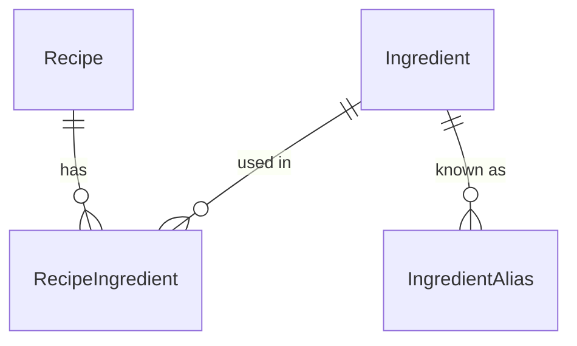

# 🎃 recipe-app — Self-Hosted Recipe & Shopping List


> **Self-hosted, ad-free web application for managing recipes, generating weekly
> suggestions and deriving a shopping list from them.**
>
> A private project for a single household to begin with: no multi-tenancy, no public
> sign-up. Opening it up as a multi-user application is the long-term plan and is already
> designed — see [Multi-user (V4)](docs/DECISIONS.md#multi-user-v4).
>
> The V1 API is deliberately built **twice** — once in NestJS, once in ASP.NET Core against
> the same PostgreSQL database and the same contract. That second implementation is the
> point of the project as much as the application is.

## ✨ Why this exists

Four apps' worth of features, without the four apps:

- a recipe book and a weekly meal plan, like Chefkoch
- a shopping list built from that plan, like Bring!
- random suggestions for when nothing comes to mind, like HelloFresh — minus
  the subscription box
- calories and macros per serving, and what the planned week adds up to, like
  Lifesum — without logging every meal by hand

None of the four is new on its own. The point is that they stop being separate:
the plan is built from your own recipes, the shopping list is built from the
plan, and the nutrition figures come from the same recipes the plan is made of.
Because the plan already knows what is for dinner, the planned meals need no
logging. It is not a full food diary — a snack outside the plan is not counted —
but it answers the question most weeks actually pose.

Free, ad-free, no account required, running on hardware you own.

## 📊 Status

Under development. See [Roadmap](#roadmap) for what is and is not implemented.

## 🧱 Tech stack

| Layer          | Choice                                         |
| -------------- | ---------------------------------------------- |
| Backend        | NestJS, TypeScript                             |
| ORM            | Prisma                                         |
| Second backend | ASP.NET Core, C#, EF Core — in progress, [see decisions](docs/DECISIONS.md#second-backend-aspnet-core) |
| Database       | PostgreSQL 18                                  |
| Frontend       | Angular, standalone components                 |
| Runtime        | Docker Compose                                 |

## 📋 Requirements

- Node.js 24 (see `.nvmrc`)
- .NET SDK 10 (see `global.json`) — only for the second backend
- Docker with Compose v2
- Optionally a PostgreSQL client (`postgresql-client`, DBeaver, pgAdmin) to
  connect to the database from the host

## 🚀 Getting started

```bash
# For Web connection
git clone https://github.com/LittlePumpkin87/recipe-app
# For SSH connection
git clone git@github.com:LittlePumpkin87/recipe-app.git

cd recipe-app

# 1. Create your environment file
cp .env.example .env

# 2. Generate a database password and put it into BOTH POSTGRES_PASSWORD
#    and the password part of DATABASE_URL in .env
openssl rand -hex 32

# 3. Start the database
docker compose up -d db

# 4. Install dependencies
npm install

# 5. Create the database tables
cd apps/api && npx prisma migrate dev && cd ../..

# 6. Optional: fill the database with development data
cd apps/api && npx prisma db seed && cd ../..

# 7. Start the API in watch mode
npm run start:dev -w api
```

The API listens on http://localhost:3000.

Step 5 is the one that is easy to miss: steps 1 to 4 leave you with a running
but completely empty database. See [Prisma and migrations](#prisma-and-migrations)
for what that command does and why it is the only one run from inside
`apps/api`.

Verify that the database is up:

```bash
docker compose ps          # db should report "healthy"
```

### Running the .NET backend instead

The second backend serves the same endpoints from the same database. Only one of
them runs at a time. Steps 1 to 5 above still apply — the database and its tables
are shared, and Prisma owns the schema either way.

```bash
dotnet run --project apps/api-dotnet
```

It listens on http://localhost:5000, so it does not collide with the NestJS API
on port 3000. `requests.http` sits in the repository root and carries both ports
as `@host`, one of them commented out — the REST Client uses the last assignment
that is not commented, so switching backends means moving the `#` by one line.

The port lives in `apps/api-dotnet/Properties/launchSettings.json`. That file is
read by `dotnet run` only — a container ignores it and takes `ASPNETCORE_URLS`
instead.

**Editor support.** The Microsoft C# extension is not available on Open VSX,
because its licence restricts it to official Visual Studio Code builds. VSCodium
users need an alternative; this project uses
[DotRush](https://open-vsx.org/extension/nromanov/dotrush) (`nromanov.dotrush`),
which brings its own Roslyn-based language server.

### A note on the password

`DATABASE_URL` is a URI, in which `:`, `@`, `/`, `?` and `#` carry structural
meaning. A password containing any of them breaks the connection string unless
it is percent-encoded — and then the same secret would have to be written in
two different spellings inside `.env`.

Generating the password with `openssl rand -hex 32` avoids this: hex output
contains only `0-9a-f`, so the identical literal can be used in both places.
Do not use `openssl rand -base64`, whose alphabet includes `+`, `/` and `=`.

## 📁 Repository layout

This is an npm workspaces monorepo. Application packages live under `apps/`.

```
.
├── apps/
│   ├── api/                # NestJS backend (workspace name: "api")
│   │   ├── prisma/         # schema, migrations and seed.ts
│   │   └── src/
│   │       ├── common/             # helpers shared by seed and services
│   │       ├── generated/prisma/   # Prisma client — generated, never edited
│   │       ├── prisma/             # PrismaService, global
│   │       ├── recipes/            # feature module
│   │       └── ingredients/        # feature module
│   └── api-dotnet/         # ASP.NET Core backend (project: RecipeApi)
│       ├── Controllers/    # attribute-routed controllers
│       ├── Services/       # business logic and the only place queries live
│       ├── Dtos/           # response records — one file per resource
│       ├── Data/           # RecipeDbContext — scaffolded, plus one partial
│       ├── Models/         # entity classes — scaffolded, plus the unit enum
│       ├── Utility/        # UrlExtensions: DATABASE_URL → Npgsql
│       └── Properties/     # launchSettings.json — local ports only
├── .config/                # dotnet-tools.json — pins dotnet-ef
├── requests.http           # example requests — tests either backend
├── docker-compose.yml      # local infrastructure
├── global.json             # pins the .NET SDK version
├── .env                    # local secrets — never committed
└── .env.example            # template for .env
```

## ⚙️ Backend

The API is an npm workspace named `api`. Run its scripts from the repository
root using the `-w` flag:

```bash
npm run start:dev -w api    # watch mode
npm run start:prod -w api   # run the compiled build from dist/
npm run build -w api        # production build
npm run test -w api         # unit tests
npm run test:e2e -w api     # end-to-end tests
npm run test:cov -w api     # unit tests with coverage report
npm run lint -w api         # oxlint over src/ and test/
npm run format -w api       # prettier over src/ and test/
npm install <pkg> -w api    # add a dependency to the API, not to the root
```

Always pass `-w api` when installing. Because npm workspaces hoist packages
into the root `node_modules`, an import can resolve successfully even though
the dependency is not declared in `apps/api/package.json` — which only breaks
once the API is deployed on its own.

Environment variables are read from the `.env` file in the repository root.
`npm run <script> -w api` sets the working directory to `apps/api`, not to the
repository root, so both places that load the file resolve it two levels up:
`ConfigModule` in `src/app.module.ts` for the running application, and
`prisma7.config.ts` for the Prisma CLI.

Inside `src/`, each area of the domain gets one folder holding three files: a
module, a controller and a service. The controller receives HTTP requests and
knows about paths, status codes and query parameters. The service holds the
logic and is the only place a database query may live. The module wires the two
together — it binds the controller to routes at startup and makes the service
injectable, but takes no part in handling a request.

The split pays off when the data source changes: turning a service method into
a Prisma query leaves its controller untouched. New folders are created with
`npx nest g module <name>` from inside `apps/api`, which also registers the
module in `src/app.module.ts`.

The API is compiled to CommonJS. `apps/api/tsconfig.json` sets
`"module": "nodenext"`, which defers to the `type` field of the nearest
`package.json`; since none is set, the emitted output is CommonJS and relative
imports are written without a file extension.

A JSDoc block is written only where deleting it would lose information: why a
file exists, a promise the types cannot express (a sort order, an `amount`
already converted from `Decimal`), or a deliberate absence — such as the missing
lookup before the insert in `IngredientsService.create`. A block that restates a
name or a field list is left out, so a self-explanatory interface gets none.
Where a block exists, it sits directly above the declaration, not above the
imports: TypeScript attaches the text to the symbol, so hovering
`PrismaService` anywhere in the editor shows it without opening the file.

### DTOs, mappers and validation

No Prisma row ever leaves a service. Each feature folder holds a `dto/` folder
and a mapper, and the three shapes involved are deliberately different:

| | Prisma model | Response DTO | Request DTO |
|---|---|---|---|
| Describes | how a row is stored | what the API returns | what a client may send |
| `ingredient.id` | ✓ | ✓ | —, Postgres assigns it |
| `ingredient.nameNormalized` | ✓ | — | —, the service derives it |

`RecipeDetailDto` shows why this is not busywork: it exposes a field called
`ingredients` that exists in no table. In the database the relation is called
`recipeIngredients` and the ingredient name sits one table deeper; the mapper
pulls it up and converts `amount` from a Prisma `Decimal` to a plain number,
which would otherwise serialise as a quoted string. The list DTO drops
`instructions` entirely so the overview stays small as the recipe count grows.

Each mapper derives its input type from the same `select` or `include` constant
the service queries with — `Prisma.RecipeGetPayload<{ select: typeof
recipeListSelect }>` — so a column removed from the query becomes a compiler
error in the mapper rather than an `undefined` in a response.

**Response DTOs are interfaces, request DTOs are classes.** That is not a style
choice. `main.ts` registers a global `ValidationPipe`:

```ts
app.useGlobalPipes(
  new ValidationPipe({
    whitelist: true,
    forbidNonWhitelisted: true,
    transform: true,
  }),
);
```

A pipe runs between the request and the controller method: it receives the raw
value, returns the value the parameter will hold, or throws. `ParseUUIDPipe` on
`GET /recipes/:id` is the same mechanism in its smallest form.

The `class-validator` decorators — `@IsString()`, `@MaxLength(120)` — do not
check anything by themselves. They register metadata, and the pipe is what calls
`validate()` and reads it. To know *which* class to validate against, the pipe
reads the declared type of the parameter, which the compiler emits thanks to
`emitDecoratorMetadata`. An interface is erased at compile time and leaves
nothing to read, so a request DTO written as an interface would be waved
through unchecked. Response DTOs are never validated and stay interfaces.

The three options each buy something specific. `whitelist` drops properties that
carry no validation decorator, so a client cannot smuggle in an `id`.
`forbidNonWhitelisted` turns that silent drop into a 400 naming the field, which
is the difference between debugging a typo and not noticing it. `transform`
turns the parsed JSON into a real instance of the DTO class, which is what
nested DTOs and type coercion need.

Validation rules belong in the DTO even where the database has its own
constraint. `NOT NULL` forbids `NULL`, not `""` — a minimum length is an API
question. `@MaxLength(120)` mirrors `@db.VarChar(120)` on purpose: the database
protects itself, the DTO tells the client what is allowed, and the difference
shows up as a 400 with a field name instead of a 500 with a database error.

**Optional is not the same as nullable.** `@IsOptional()` skips every other rule
when a value is `undefined` *or* `null`. That is right for a column that may be
empty — `"description": null` clears the description — and wrong for one that
may not: `"servings": null` would pass validation and then fail inside Prisma,
because the column is `NOT NULL`, as a 500. Such fields use
`@ValidateIf((_, value) => value !== undefined)` instead: a missing value is
skipped, `null` is validated and rejected with a 400. `UpdateRecipeDto` is built
with `PartialType(CreateRecipeDto, { skipNullProperties: false })` for the same
reason — the option makes `PartialType` add that `@ValidateIf` rather than
`@IsOptional` to every field it turns optional.

## 🗄️ Data model

Four models and one enum. The join table carries the amount, the unit and three
presentation fields in addition to the relation, which is why it is written out
explicitly rather than left to Prisma's implicit many-to-many.



| Model | Purpose |
|---|---|
| `Recipe` | Title, description, instructions, servings, `prepMinutes` and `totalMinutes`, optional import provenance. |
| `Ingredient` | Central ingredient list. One row per ingredient, shared across recipes. |
| `IngredientAlias` | Alternative spellings pointing at an ingredient ("zwiebeln" → "Zwiebel"). |
| `RecipeIngredient` | Join table between the two, carrying `amount`, `unit`, a per-line `note`, a `groupLabel` and the `position` within the recipe. |

### Naming convention

Models are PascalCase and singular in the schema (`Recipe`), fields are
camelCase. In Postgres everything is snake_case, produced by `@@map` on models
and enums and `@map` on multi-word columns. The enum is easy to forget: without
`@@map("unit")` the type is created as `"Unit"` and needs quoting everywhere,
even though every table around it does not.

The reason is ergonomic: Prisma quotes identifiers when creating them, so an
unmapped model would become a table named `"IngredientAlias"` that needs double
quotes in every hand-written `psql` query. Enum values are English like the rest
of the repository; the display form is the frontend's job.

Note that PascalCase applies to model *names* only, not to their fields.

<a id="prisma-and-migrations"></a>

## 🧬 Prisma and migrations

The schema lives in `apps/api/prisma/schema.prisma`, migrations in
`apps/api/prisma/migrations/`.

```bash
cd apps/api

npx prisma migrate dev --name <name>   # create and apply a migration
npx prisma migrate dev --name <name> --create-only   # write the SQL only, apply later
npx prisma migrate deploy              # apply existing migrations (production)
npx prisma db seed                     # wipe and rewrite the development data
npx prisma studio                      # browse and edit data in the browser
npx prisma validate                    # check the schema
npx prisma format                      # format and complete relations
```

**These are the only commands run from inside `apps/api`.** Everything else uses
`-w api` from the root. Prisma resolves `schema.prisma` relative to the working
directory, and `apps/api/prisma7.config.ts` loads the repository-root `.env`
explicitly, two levels up, before handing `DATABASE_URL` to the datasource. That
config file exists precisely because the `.env` does not sit next to the schema.

**Read a migration that touches existing data before it runs.** `--create-only`
writes the SQL file without applying it; read it, then run `npx prisma migrate
dev`. One trap: `--create-only` only holds back the *new* migration. `migrate
dev` always applies pending migrations first, so running `--create-only` a
second time applies the first one — and, finding nothing left to change, writes
an empty migration next to it. Delete an empty one before it is applied; once it
is recorded in `_prisma_migrations`, removing the folder makes Prisma report the
history as out of sync.

**Migration files are committed.** Prisma writes plain SQL into
`prisma/migrations/<timestamp>_<name>/migration.sql`, and the applied history is
tracked in a `_prisma_migrations` table inside the database. That is what lets a
fresh clone reach the identical schema, and what makes a schema change
reviewable in a pull request.

**The generated client is not committed.** The generator writes to
`apps/api/src/generated/prisma`, which is listed in `apps/api/.gitignore`. It is
build output derived from the schema and would otherwise produce enormous, noisy
diffs. `prisma migrate dev` regenerates it; `npx prisma generate` does so on its
own if you only pulled someone else's migration.

**Prisma 7 requires a driver adapter.** The Rust query engine is gone, so the
client cannot open a connection by itself — which is why the `datasource` block
in `schema.prisma` carries no `url`. `@prisma/adapter-pg` wraps the `pg` driver
and is handed to the client when it is constructed, in
`apps/api/src/prisma/prisma.service.ts`:

```ts
const adapter = new PrismaPg({
  connectionString: config.getOrThrow<string>('DATABASE_URL'),
});
super({ adapter });
```

Three consequences. The connection string reaches the *adapter*, never the
client, so guides written for Prisma 5 or 6 that pass a URL to
`new PrismaClient()` no longer apply. `@prisma/adapter-pg` and `@prisma/client`
must be kept on the same version, because they speak an internal protocol that
may change between releases — upgrade them together. And `pg` is deliberately
not a direct dependency; the adapter brings it, so only one place pins its
version.

`DATABASE_URL` reaches the service through `ConfigService`, not through
`process.env` directly. `getOrThrow` aborts the start with the name of the
missing variable instead of failing later, on the first request.

### Seeding

`prisma/seed.ts` fills an empty database with development data. It is registered
in `prisma7.config.ts` under `migrations.seed` and runs via `npx prisma db seed`
from inside `apps/api`.

**It is destructive by design.** Every run empties `recipe_ingredient`, `recipe`
and `ingredient` — in that order, because foreign keys forbid the reverse — and
writes the same recipes again. The result is identical on every run, which is
the point: development against a known data set. `ingredient_alias` needs no
call of its own, its foreign key cascades.

Because `deleteMany()` without a `where` clause deletes every row without
confirmation, the script refuses to run unless `DATABASE_URL` points at
`localhost` or `127.0.0.1`.

**It is not a delivery mechanism.** A handful of recipes is enough, because
their only job is to prove that a shared ingredient resolves to a single
`ingredient` row. Real recipes arrive through `POST /recipes` and, from V3, the
URL importer — see [Shipped starter recipes](docs/DECISIONS.md#shipped-starter-recipes).

The seed is also the rehearsal for `POST /recipes`: normalise the name, `upsert`
on `nameNormalized`, keep the returned ids in a `Map`, then write the recipes
and their join rows — all inside one `$transaction`. Every call within that
block goes through `transactionClient`, never through `prisma`, or it runs
outside the transaction and is not rolled back with it. The name is longer than
the usual `tx` on purpose: it is Prisma's own type name
(`Prisma.TransactionClient`), and it makes a stray `prisma.` call inside the
block stand out.

**`prisma format` completes as well as formats.** Given half a relation it will
add the missing opposite field, move `@relation` to the side holding the foreign
key, and turn a singular relation field into a list. It makes a schema *valid*,
not *correct* — it never decides `onDelete` for you, because that is a
behavioural choice. Run it once you are happy with what you wrote, otherwise you
lose track of which lines are yours.

### Prisma Studio

```bash
cd apps/api && npx prisma studio
```

Opens a browser UI on http://localhost:51212. This is the tool to reach for when
working with *data*; use `psql` or a SQL client for questions about *structure*.

Two things it does that a generic SQL client cannot:

**It knows the schema.** Relations are links rather than raw UUIDs, so a recipe
lists its ingredients and each one navigates through to the ingredient itself.
`unit` is a dropdown of the `Unit` enum, not a free-text field that lets you
type a value the column will reject.

**It writes through the Prisma client, so client-side behaviour applies.** `id`,
`created_at` and `updated_at` all have database-level defaults — see the
`db_level_defaults` migration — so a hand-written `INSERT` in psql that omits
them works too. What psql does *not* do is `@updatedAt`: a database default only
fires on INSERT, so an `UPDATE` in psql leaves `updated_at` at its old value,
while the same edit in Studio moves it. If a row's timestamp looks stale, that
is usually why.

It is worth having open while building `POST /recipes`: seeding an ingredient by
hand and watching the join rows appear is faster feedback than a test run.

## 🔌 API endpoints

V1 only. There is no login, and no endpoint is authenticated. Both backends serve
the same contract; the two columns track how far the second one has got.

| Method | Path | Purpose | NestJS | .NET |
|---|---|---|---|---|
| GET | `/recipes` | List, with optional `?search=` on the title | built | built |
| GET | `/recipes/:id` | Single recipe including its ingredients | built | built |
| POST | `/recipes` | Create, including the ingredient list | built | — |
| PATCH | `/recipes/:id` | Update; a present ingredient list replaces the old one | built | — |
| DELETE | `/recipes/:id` | Delete, `204` without a body | built | — |
| GET | `/ingredients` | Autocomplete, `?search=`, capped at 20 results | built | — |
| POST | `/ingredients` | Create an ingredient, 409 if the name exists | built | — |

### How the two searches differ

Both search endpoints take `?search=` and both match on a substring, but they
compare against different columns, and the reason is worth knowing before
copying one into the other.

`GET /recipes?search=` filters on `recipe.title`, which stores the display form.
There is no second column to compare against, so the query asks Postgres to
ignore case with `mode: 'insensitive'` — Prisma turns that into `ILIKE`.

`GET /ingredients?search=` filters on `ingredient.nameNormalized` and pushes the
search term through the same `normalizeIngredientName` that wrote the column.
Both sides are lowercase, trimmed and NFC-normalized by the time they meet, so
no `mode` is needed. It is also the more correct of the two: `ILIKE` handles
case, but not an `ö` that arrived as `o` plus a combining diaeresis — a real
possibility with text pasted from elsewhere.

The rule that follows: **compare against `nameNormalized`, display `name`.** It
holds for the search, for `POST /ingredients` and for the lookup inside
`POST /recipes`.

Recipe titles have no normalized column and do not need one. `?search=roemer`
finding *Römertopfbrot* is a nice-to-have; an ingredient list that grows a
second `Öl` row is a data defect.

### `POST /recipes`: one request, one transaction

`POST /recipes` receives the recipe and its ingredient list in a single request.
Ingredients are referenced by name, never by id. For each line the service
normalizes the name and `upsert`s on `ingredient.nameNormalized`: an existing
ingredient is linked, a new one is created first. A name that appears twice in
one request — `"Salz"` for the soup and `" salz "` to taste — is looked up once;
the ids are kept in a `Map` keyed by the normalized name, so both lines point at
the same ingredient. `position` is taken from the index in the incoming list,
starting at 1.

All of it runs in **one transaction**. The ingredients are written first, the
recipe and its join rows last, so the case that matters is a failure in between:
a dropped connection or a restart must not leave a freshly created ingredient
behind without a recipe. Every call inside the `$transaction` callback goes
through `transactionClient`. A single `this.prisma.` call in there would run on
a different connection, commit on its own and survive the rollback — and every
successful request would look exactly the same, which is why it has to be
tested with a failure.

That test was done by hand: with a temporary `throw` between the ingredient loop
and `recipe.create`, a request containing a new ingredient answers `500` and
leaves neither the ingredient nor the recipe in the database. Nest answers a
plain `Error` with a generic `Internal server error` on purpose, since its
message may contain internals; the message and stack trace appear only in the
server log.

On success the response is `201` with the same shape as `GET /recipes/:id`. The
mapper runs after the commit, outside the transaction.

**Aliases are not consulted in V1.** `resolveIngredientIds`, shared by
`POST /recipes` and `PATCH /recipes/:id`, looks at `nameNormalized` only, so a
name that exists solely as an `ingredientAlias.alias` becomes a new ingredient.
The alias lookup arrives with the V3 importer, the first source of spellings
nobody typed in by hand; until then the autocomplete in the recipe form is the
protection against duplicates. There is deliberately no endpoint for managing aliases in V1 either:
the table is meant to be filled by hand through `prisma studio`, and aliases are
rare exceptions until the V3 importer starts producing them.

### `DELETE /recipes/:id`: one statement, no transaction

Deleting a recipe touches two tables and still needs no transaction. The foreign
key from `recipe_ingredient` to `recipe` is declared `ON DELETE CASCADE`, so
Postgres removes the join rows as part of the same `DELETE` statement, and a
single statement is always all or nothing. `POST /recipes` needs `$transaction`
because it sends several statements in a row; this endpoint sends one. The
ingredients themselves stay — the cascade only runs from a recipe to its lines.

The service deletes without looking first, for the same reason `POST
/ingredients` inserts without looking first: a missing row surfaces as Prisma
error `P2025` and becomes a `404`. A successful delete answers `204 No Content`,
since the client already knows which recipe it removed. A second `DELETE` on the
same id answers `404`.

### `PATCH /recipes/:id`: fields in place, ingredient list replaced

A field missing from the request is left untouched: Prisma treats `undefined` as
"do not change", so `{ "title": "…" }` renames the recipe and nothing else.
`null` is different — it clears a nullable column such as `description`, and is
rejected with a `400` for a `NOT NULL` one (see "Optional is not the same as
nullable" under [DTOs, mappers and validation](#dtos-mappers-and-validation)).

A present `ingredients` replaces the whole list. Inside one transaction the
service updates the recipe's own fields, resolves the ingredient names exactly
as `POST /recipes` does — both call the same private `resolveIngredientIds` —
deletes every `recipe_ingredient` row of the recipe and writes the new list,
positions again taken from the index. An ingredient that dropped out of the list
is unlinked, not deleted; it stays in `ingredient` for other recipes.

`updatedAt` is set explicitly in the update. A request carrying only
`ingredients` leaves every recipe field `undefined`; Prisma then sends no
`UPDATE` for the recipe at all, and `@updatedAt`, which only rides along on an
`UPDATE`, never fires — a recipe whose flour went from one to two tablespoons
would look untouched. This was found by comparing `updated_at` in psql before
and after such a request.

That assignment is on its way out. The decision of 15 September 2026 moves
`updated_at` into the database as two triggers, the second of which covers
exactly this case — an ingredient-only edit — by touching the parent recipe. The
explicit assignment is what keeps the timestamp honest until that migration is
written. See [Second backend: ASP.NET Core](docs/DECISIONS.md#second-backend-aspnet-core).

Replacing gives the join rows new ids on every edit. That is harmless as long as
nothing points at a single row: the meal plan will point at recipes, the
shopping list at ingredients, nutrition figures at either. Should that change,
the rows already carry their own `id`, so a line-by-line comparison would change
the API and the service, not the schema.

**The order inside the transaction matters.** The recipe update runs first. For
an unknown id it raises `P2025` before anything has been written, and the
service answers `404`. Resolving the ingredients first would create ingredients
for a recipe that does not exist, and inserting the join rows would then fail on
the foreign key with `P2003` — rolled back all the same, but answered with a
`500`. The `catch` sits around the whole `$transaction`, never inside the
callback: an error caught in there would let the callback finish normally, and
Prisma would commit.

On success the response is `200` with the updated recipe, read with
`findUniqueOrThrow` at the end of the transaction — a query that already sees
the transaction's own, not yet committed writes.

### Duplicates: let the constraint decide

`POST /ingredients` does not look for an existing row before it writes. It
inserts, and the unique index on `ingredient.name_normalized` decides. If the
name is taken, Postgres refuses the insert, Prisma raises error code `P2002`,
and the service turns that into `409 Conflict`.

A lookup first would not save the catch, only add a query. Two requests for
"Zwiebel" arriving together would both find nothing and both insert, and the
second would still hit the index — as an unhandled 500. The index is the only
check that holds when requests overlap, so it is the only check.
`POST /recipes` relies on the same index for the ingredients it creates.

Two consequences worth knowing:

- **The first spelling wins.** `" ZWIEBEL "` and `"Zwiebel"` normalize to the
  same value, so whichever arrives second is refused, and the ingredient keeps
  the display form of the first. There is no `PATCH /ingredients` in V1;
  rename it in Prisma Studio.
- **Aliases are not checked here.** A name that exists only as an
  `ingredientAlias.alias` is accepted as a new ingredient. The alias lookup
  arrives with the V3 importer, in the ingredient resolution shared by
  `POST /recipes` and `PATCH /recipes/:id`.

## 🐘 Working with the database

The database runs in a container. Its data lives in the named Docker volume
`pgdata` and survives container restarts.

```bash
docker compose up -d db                            # start
docker compose stop db                             # stop, keep data
docker compose logs db                             # inspect logs
docker compose exec db psql -U recipe -d recipe    # SQL shell inside the container
docker compose down -v                             # stop and DELETE all data
```

`docker compose down -v` is the way to start over from an empty database.

### Connecting from the host

This is the path the API uses, and the one worth verifying after any change to
`.env` or `docker-compose.yml`:

```bash
psql "postgresql://recipe:<password>@localhost:5432/recipe"
```

```sql
SELECT version();          -- must report 18.x, i.e. the container, not a local server
\conninfo                  -- shows host, port and user of the current connection
```

Note that `docker compose exec db psql ...` connects from inside the container
and therefore does **not** verify the published port, the password in
`DATABASE_URL`, or anything else the API depends on.

Do not install the `postgresql` package to get a client — it brings a server
that binds to port 5432 and will collide with the container. Install
`postgresql-client` instead.

### Timestamps

`created_at` and `updated_at` are `timestamptz(3)` — *timestamp with time
zone*. Despite the name, no zone is stored: the column holds an exact moment,
kept internally as UTC, and converts it on output into the time zone of the
connection, with the offset attached. A change made at 11:43 in Berlin in summer
reads `2026-09-11 09:43:05+00` in a UTC session and `2026-09-11 11:43:05+02`
after `SET timezone = 'Europe/Berlin';` — the same moment, spelled two ways.
Some SQL clients convert to local time on their own.

Until the `timestamptz` migration the columns were plain `timestamp(3)`,
*without* time zone: a date and a clock reading, `09:43:05`, with nothing to say
which zone it belongs to. That it meant UTC was a convention Prisma kept; every
other writer — psql, a trigger, the .NET backend — would have had to know it
too. The PostgreSQL wiki's "Don't Do This" page advises against plain
`timestamp` for exactly this reason. The migration converted the existing values
by reading them in the session's time zone, which is UTC in the container, so
they stayed correct. `SHOW timezone;` is the check to run before such a
migration.

Converting to a user's local time is the frontend's job. The API sends
`"2026-09-11T09:43:05.123Z"`, and Angular's `DatePipe` formats it in the
browser's time zone; neither the API nor the database needs to know where a user
is.

**Moments and days are different types.** Something that *happened* — created,
edited — is a moment and gets `timestamptz`. Something *planned for a day*, such
as a V2 meal plan entry for Tuesday, 15 September, is a calendar date and gets
`date`. Stored as a moment it would be midnight UTC, which a user in New York
sees as Monday, 8 pm — and the soup lands on the wrong day.

### Things that will bite you

**Credentials are only applied to an empty volume.** `POSTGRES_USER`,
`POSTGRES_PASSWORD` and `POSTGRES_DB` are evaluated by the image only during
first-time initialisation. Changing them in `.env` afterwards has no effect and
results in `password authentication failed`. Remove the volume with
`docker compose down -v` to re-initialise.

**Port conflicts.** If 5432 is already in use, set `POSTGRES_PORT` in `.env` to
a free port and update the port inside `DATABASE_URL` to match.

**The volume is mounted at `/var/lib/postgresql`, not at `.../data`.** From
version 18 on, the PostgreSQL image stores data in a major-version
subdirectory (`/var/lib/postgresql/18`). Mounting the parent directory keeps
the old and the new data directory inside a single mount, which
`pg_upgrade --link` requires for a future major version upgrade. Most guides
online still show `/var/lib/postgresql/data`; those are written for version 17
and earlier.

To confirm the data actually lands in the volume:

```bash
docker compose exec db ls -la /var/lib/postgresql   # should contain a "18" directory
```

### Backups

Run `pg_dump` inside the container rather than on the host:

```bash
docker compose exec db pg_dump -U recipe -d recipe > backup.sql
```

`pg_dump` refuses to dump from a server newer than itself, so running it in the
container guarantees matching versions regardless of what is installed on the
host — and it works the same way on any machine the project is deployed to.

Restore into an empty database with:

```bash
docker compose exec -T db psql -U recipe -d recipe < backup.sql
```

<a id="roadmap"></a>

## 🛠️ Roadmap

**V1** — recipe CRUD, central ingredient list without duplicates, search by
title, mobile friendly, WCAG AA.

**V2** — random weekly suggestions, meal plan, shopping list.

**V3** — recipe import from URLs via schema.org metadata.

**V4** — multi-user operation. Designed, deliberately not built. See
[Multi-user (V4)](docs/DECISIONS.md#multi-user-v4).

**Later** — tags (vegetarian, quick, oven dish) and nutrition figures, both
usable as filters for the random suggestions. See [Nutrition](docs/DECISIONS.md#nutrition). A
photo per recipe, see [Recipe images](docs/DECISIONS.md#recipe-images).

**Build order within V1.** The API gets a second implementation before the
application gets a frontend: the NestJS API is finished first, then rebuilt in
ASP.NET Core, then the Angular frontend follows, and finally Docker Compose and
a CI pipeline that builds both backends and runs the same requests against each.
See [Second backend: ASP.NET Core](docs/DECISIONS.md#second-backend-aspnet-core).

## 📄 License

Copyright (C) 2026 Little Pumpkin Design (Jennifer Roob)

Licensed under the GNU Affero General Public License v3.0 — see [LICENSE](LICENSE).

Section 13 of the AGPL requires that anyone interacting with the software over a
network be offered a link to its source. There is no user interface yet; the
link will be part of the frontend from the moment one exists.

---

## 📖 Documentation

| File | Contents |
|---|---|
| [docs/DECISIONS.md](docs/DECISIONS.md) | Every design decision, including the alternatives that were rejected and why — data model, the second backend, nutrition, images, multi-user, and the accepted audit findings |
| [requests.http](requests.http) | Example requests, runnable against either backend |
| [CLAUDE.md](CLAUDE.md) | Working agreement and project context |
